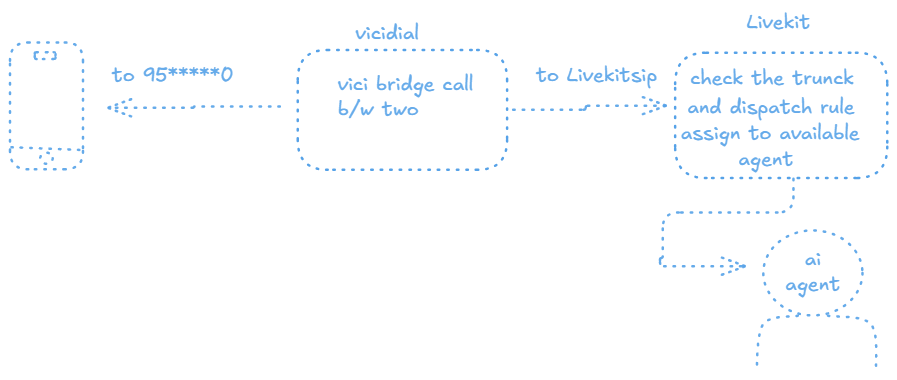

## Instruction To Follow 

1. **To Generate api secret**: `openssl rand -base64 32`

2. **To Create Inbound Trunk** :
```
lk sip inbound create \
  --name "inbound-calls" \
  --numbers "agent" \ 
```
3. **To view trunk** : `lk sip inbound list`

4. **To create dispatch rule**: 
```
lk sip dispatch create \
  --name "vicidial-dispatch" \
  --trunks "[add_trunk_id]" \
  --caller voice-call- ****
```
5. **To view rule**: `lk sip dispatch list`

6. **To view rooms**: `lk room list`


# ---------------------------------------
## Vicibox Configuration

**Add the below pjsip.conf**
```
[transport-udp]
type=transport
protocol=udp
bind=0.0.0.0:5060
tos=ef

[livekit-endpoint]
type=endpoint
transport=transport-udp
context=from-livekit
disallow=all
allow=ulaw,alaw
aors=livekit-aor
direct_media=no
rtp_symmetric=yes
force_rport=yes
rewrite_contact=yes
from_user=agent
from_domain=192.168.1.61

[livekit-aor]
type=aor
contact=sip:192.168.1.61:5060
qualify_frequency=0

[livekit-identify]
type=identify
endpoint=livekit-endpoint
match=192.168.1.61

```

**And the extension.conf**
```
exten => 9000,1,NoOp(Call to LiveKit Agent)
 same => n,Dial(PJSIP/agent@livekit-endpoint,30)
 same => n,Hangup()

```


**Command to check whether, headrs values are passing form vici**
```
root@livekit:/opt/greet ## tcpdump -An -s0 -i any port 5060 | grep X-VC-Payload
tcpdump: data link type LINUX_SLL2
tcpdump: verbose output suppressed, use -v[v]... for full protocol decode
listening on any, link-type LINUX_SLL2 (Linux cooked v2), snapshot length 262144 bytes
X-VC-Payload: V1301303390000000380
X-VC-Payload: V1301303390000000380
```